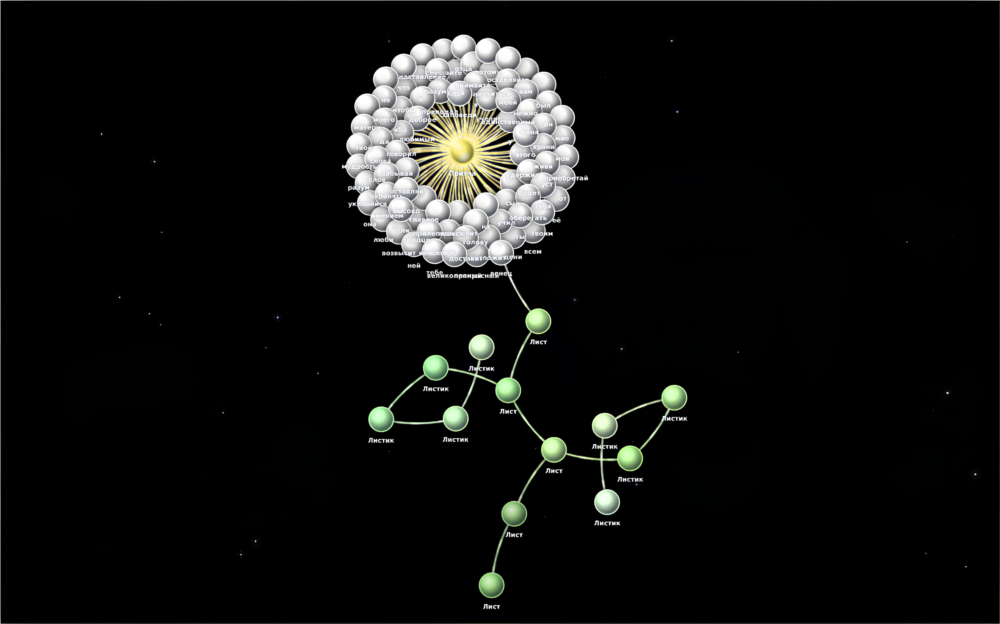
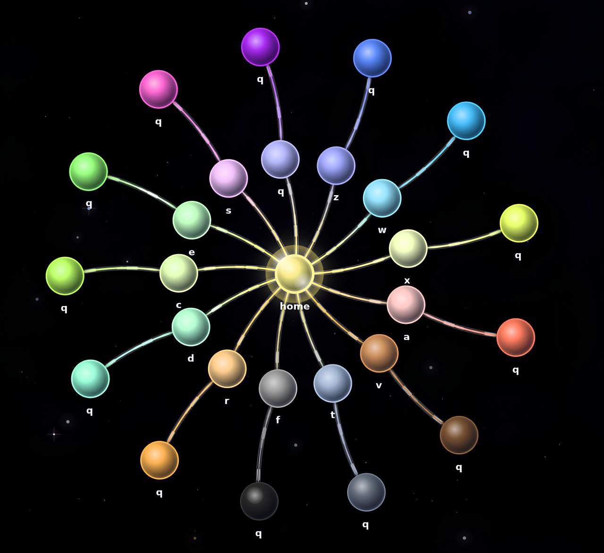
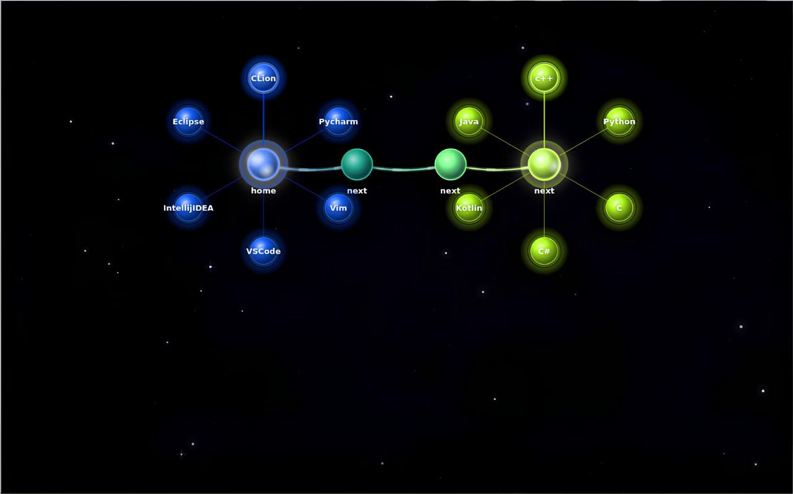

<h1 align="center">Graph Filesystem</h1>

<p align="center">
  <strong>Advanced C++ Visualization & MVC Engine</strong>
</p>

<p align="center">
  
  
  
</p>

<p align="center">
  
  
</p>

---

<h3 align="center"><strong>Core Architecture</strong></h3>
<p align="center">
  
  
  
</p>

<h3 align="center">Algorithms & Data</strong></h3>
<p align="center">
  
  
</p>


## Compilation

```
cmake ..
cmake --build
```

## Executables

```
main
```


<h1 align="center">About program</h1>

## Демонстрация проекта

<div align="center">
<video width="900" height="500" controls poster="screenshots/gui.png">
  <source src="screenshots/FileSystem.mp4" type="video/mp4">
</video>
</div>

### Данный проект собой представляет другой вариант визуализации файловой системы - с помощью древовидного графа



### В проекте реализована физика взаимодействия узлов

### В программе реализована "фабрика команд", благодаря чему была реализована динамическая загрузка библиотек

</strong>

 - Model/PluginHandler - реализация динамической загрузки команд
 - cFind - пример написания плагина
 - install {filepath} - командлет внутри системы, которым можно в runtime установить дополнительную команду

<strong>

## Была выбрана Архитектура MVC 

## В команде cFind была продемонстрирована работа с многопоточностью

## В каталоге STL реализован шаблонный класс table, являющийся аналогом std::map
</strong>


### реализован терминал (Нажать "T"), с помощью которого можно управлять файловой системой, полный список команд можно получить, нажав на "H"

### Файлы в каталогах-узлах можно получить, нажав "Enter", они представлены в виде кругового меню выбора, а после выбора файла будет круговой выбор команд над данным файлом

